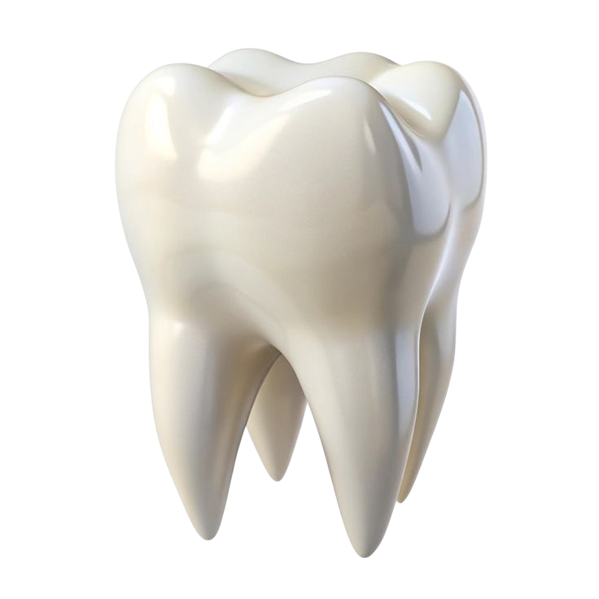

# DENTALCARE - Clinic Management System

This web application manages doctor appointments and patient records for a dental practice, built on the **LavaLust PHP MVC Framework (v4.4.0)**.

    

## 🌟 Project Features

DENTALCARE features three core roles for streamlined operations:

* **Patient (`user`):** Secure login (username/email), schedule appointments for available Doctors/Services, and manage profile/bookings.
* **Staff (`staff`):** Dashboard for appointment monitoring, confirm/cancel bookings, and view all patient accounts. Read/Update access only for Doctors/Services.
* **Admin (`admin`):** Full dashboard statistics, complete CRUD control over Doctors and Services, and user account management (including Admin/Staff roles).

***

## 🛠️ Technology Stack

| Component | Technology | Details |
| :--- | :--- | :--- |
| **Backend** | PHP 7+ | Core language for the application logic. |
| **Framework** | **LavaLust MVC** (v4.4.0) | Provides MVC structure, routing, and database abstraction. |
| **Database** | MySQL | Data storage using `users`, `doctors`, `services`, and `appointments` tables. |
| **Frontend** | Tailwind CSS | Utility-first CSS framework for a modern, responsive interface. |
| **Mapping** | **Leaflet.js** | Used to display the clinic's location on the landing page. |

### Core Modules (Models & Controllers)

The application's business logic is structured around five primary database models and their corresponding controllers:

* **Authentication & Profile:** Handled by `Auth.php` and `UserModel.php`.
* **Appointment Booking:** Handled by `Booking.php` and `AppointmentModel.php`.
* **Management:** Handled by `Management.php`, `DoctorModel.php`, and `ServiceModel.php`.

***

## LavaLust 4 (Latest 4.4.0)

    

    LavaLust is a lightweight Web Framework - (using MVC pattern) - for people who are developing web sites using PHP. It helps you write code easily using Object-Oriented Approach. It also provides set of libraries for commonly needed tasks, as well as a helper functions to minimize the amount of time coding.

## Documentation
[LavaLust Documentation Link](https://lavalust.netlify.app)

    Note: If you are using PLDT, you need to use google dns (8.8.8.8) to open the documentation website. There is
    an issue with PLDT and Netlify websites.

## Installation and Tutorials

[Checkout LavaLust Tutorial's Youtube Channel](https://youtube.com/ronmarasigan)

### Licence

    MIT License

    Copyright (c) 2020 Ronald M. Marasigan

    Permission is hereby granted, free of charge, to any person obtaining a copy
    of this software and associated documentation files (the "Software"), to deal
    in the Software without restriction, including without limitation the rights
    to use, copy, modify, merge, publish, distribute, sublicense, and/or sell
    copies of the Software, and to permit persons to whom the Software is
    furnished to do so, subject to the following conditions:

    The above copyright notice and this permission notice shall be included in all
    copies or substantial portions of the Software.

    THE SOFTWARE IS PROVIDED "AS IS", WITHOUT WARRANTY OF ANY KIND, EXPRESS OR
    IMPLIED, INCLUDING BUT NOT LIMITED TO THE WARRANTIES OF MERCHANTABILITY,
    FITNESS FOR A PARTICULAR PURPOSE AND NONINFRINGEMENT. IN NO EVENT SHALL THE
    AUTHORS OR COPYRIGHT HOLDERS BE LIABLE FOR ANY CLAIM, DAMAGES OR OTHER
    LIABILITY, WHETHER IN AN ACTION OF CONTRACT, TORT OR OTHERWISE, ARISING FROM,
    OUT OF OR IN CONNECTION WITH THE SOFTWARE OR THE USE OR OTHER DEALINGS IN THE
    SOFTWARE.

